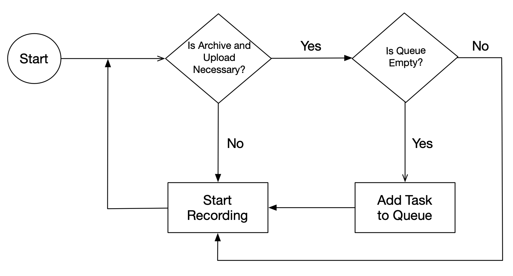

# Multithreading


## Introduction
Using threads (or some concurrency mechanism) was necessary in this project
to avoid periods of time without any recording due to the upload process. So,
the idea is to, while the upload is being performed the recording process 
continue.

After some research, my option was to use the `threading` python library, which
implements Posix Threads. I believe that using asyncio would be an option too. 
Actually, I tried the [aioboto3](https://pypi.org/project/aioboto3/), but the
lack of documentation about its usage makes me feel less comfortable and it 
was taking to much time to implement. There is a branch in the repository, where
I left part of the code I implemented for future references, but for now, 
the threading library is working fine.


## Consumer Producer Strategy
After thinking about how to implement this concurrency version, I faced another
problem. Since the upload to S3 can take a while (several minutes) after recording
another thread could be triggered and upload and archive a single record and this
process could occur several times until the first archive is placed into the 
file system.

One solution would be move the archive to another place, but since Im dealing
with a device with not so much storage available, I started to look to another
solution. So, the final solution was to create a Queue (with size of 1) and 
a single thread that monitors the Queue. Once the conditions to archive and upload
are satisfied, a task is added to the Queue. The thread will them, archive the
records, upload to the Cloud and remove the item from the Queue.

The figure below presents the workflow of the main thread. Every time, before
starting to record, we check for the conditions (number of records or amount 
of storage used). No matter what, the box "Start Recording" is always reached.
The difference is that, when the conditions are met, we add a task to the 
Queue and the thread will process it.





## Implementation

The threaded implementation is placed in the file [async_runner.py](async_runner.py).
It is very similar to the sequential version, but the tasks inside the main loop 
is placed in a routine, which will be transformed to a thread.

The first thing, we create a Queue:

```python
# Queue for Threads
task_queue = Queue(maxsize=1)
```

The thread is, basically the routine `processing` displayed below. Note that it
is a infinite loop which and after that we just check for the existence of tasks.
Also, observe that, the task is removed from the Queue only when everything is 
done. This avoid the creation of other threads.


```python
def processing():
    """
    This routine is the main consumer to the Queue. Every time an item is added
    to the Queue, this routine consumes it.
    """

    while True:
        if not task_queue.empty():
            # Archive, Upload & Remove Records & Archives
            post_recording.archive_records(db, GLOBAL_CONFIG)

            # Uploading check
            up_arch = post_recording.upload_archive(db, AWS_CONFIG)
            up_count = 0
            while up_arch is False and up_count <= 10:
                wait_time = random.randint(10, 90)
                time.sleep(wait_time)
                up_arch = post_recording.upload_archive(db, AWS_CONFIG)
                up_count += 1
            if up_count > 10:
                exit(-1)

            post_recording.remove_uploaded_archives(db)
            post_recording.remove_uploaded_records(db)

            # Removes task from queue after finishing all tasks
            task_queue.get()
```

The Queue is populated and the record start in the following code:

```python
        if perform_cleanup_routines and not task_queue.full():
            main_logger.info(
                " -- Starting CleanUP and Uploading Thread --"
            )
            task_id = str(random.randrange(0, 100000)).zfill(6)
            task_queue.put(task_id)
            main_logger.info(
                " -- Queueing Task {} -- ".format(task_id)
            )

        record_obj = audio.start_recording(db, GLOBAL_CONFIG)
        main_logger.info(
            " -- Record {} Finished -- ".format(record_obj.path)
        )
``` 

Note that the task is added only when the Queue is empty. Since our queue has
a length of 1, we can only handle one archive and upload task at time, but the
recording can be performed concurrently.
