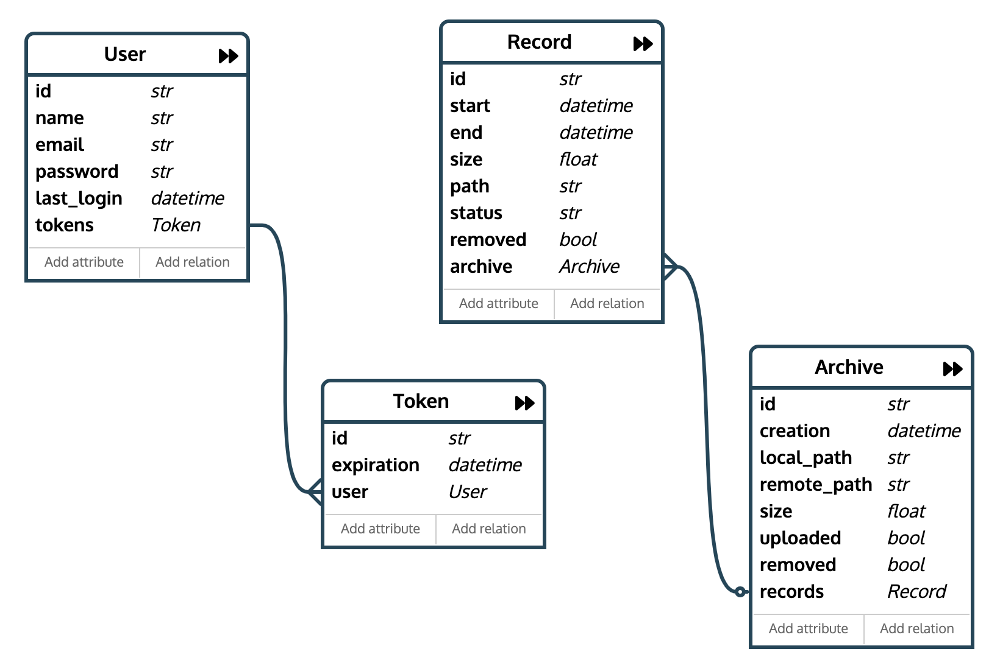

# ORM Implementation

## Introduction
In order to keep tracking of the records and archives uploaded to the Cloud this
project stores metadata into a database (SQLite). Also, the database is populated
and queried using an Object-Relational Mapping (ORM) library, the Pony ORM library.

Using an ORM library is much easier since it creates an abstraction to use 
database and query. It is only necessary to create a models file with all
schemas and relations and reference it in your code.

## Schema And Relations

The models file in this project is located [here](../database/models.py). As presented
in Figure below, there are 4 objects:

* Record: Represents a record with all metadata necessary to identify it;

* Archive: Represents a ZIP archive with a set of records. An Archive is related to
several records. Also, an Archive is the only object which is actually uploaded 
to the Cloud, so this object also contains metadata related to the S3 object;

* User: User identification. Currently, it is not being used since the API is 
not implemented yet;

* Token: Token which is provided to a user to access a given Record or Archive
without provide a password and username for a specific time period;




## Queries

All queries is consolidated into the file [query.py](../database/query.py). This
file contains main queries used to get Archives already uploaded, Records removed 
from the local file system, and so on.

So, if you need to add any new query into the project, this is the place to do
it. Note that all queries receive a `db` parameter, which is used to connect to
the SQLite database. The `db` connection is defined in `runner.py` file, as following:

```python
try:
    db = models.define_db(
        provider='sqlite',
        filename=DB_CONFIG['db_path'],
        create_db=True
    )
except DatabaseError as e:
    print("ERROR: {}".format(e))
    print("-- Recreate the DB or Try some DB Recovery Utility --")
    exit(-1)
```

Note that the path to the SQLite can be changed using the configuration file, so,
make sure the path exists beforehand.
