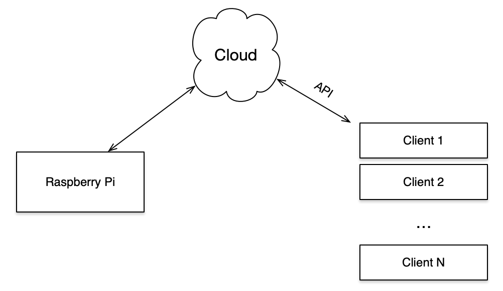

# Im Hearing

[](https://opensource.org/licenses/mit-license.php) 

## Contents
1. [Introduction](#introduction)
2. [How to Install & Use](#how-to-install-and-use)
3. [Overall Architecture](#overall-architecture)
4. [How to Contribute](#How-to-contribute)
5. [References](#references)

## Introduction

This is a personal project, in which I put in practice things like:

* Usage of Posix Threads
* Keep tracking of data stored in Cloud using local DB
* Usage of ORM

Also, Im using my RaspberryPi and a Mic to store environment sounds. The thing is
my Raspberry doesnt have so much storage available and, of course, I didn't want
to loose my records due to storage problems. So, my idea was to after a given 
number of records (or after a given amount of storage usage), the script must
archive the records and upload it to the Cloud (some cheap object store).

Of course, this idea had some problems, for example, my main concerns:

* If I want a record from a specific day of the last month, how do I get it?
* During the upload to the cloud, supposing it takes several minutes, how do I keep recording?

For the first question, I created a database using SQLite using Pony ORM to keep 
tracking of the records. So, you can just query for a specific day and it will
return the archive URL path to download. The second question I used Posix Threads 
with QUEUE (producer-consumer strategy). So when I reach the given amount of storage
or a number of records a task is added to a queue and a thread consumes it (archive
and upload).

Well, again, this is just a personal project that I created to use some hardware
that I wasn't using (actually, the Raspiberry I was using, just the USB mic was idle). So,
it is not my intention to create anything professional here or commercial, this is 
just fun.


## How to Install and Use

---
**NOTE**

Before installing, make sure ALSA is properly configured and working. For
more details, please refer to item 1 in [References](#references).

---

Before installing, be aware that Im using Python 3.7 for developing. For now, I don't think
it is a problem, since this project is not using any `asyncio` new features, but
in future versions, my intention is to use it. Let's start:

Installing the script is easy, the first step is to clone (or download) it from
the Git:

```bash
git clone https://github.com/abaruchi/ImHearing
```

After that, install the requirements:

```bash
pip install -r requirements.txt
```

Create the `config.ini` file using the [configuration template](config_example.ini):

```bash
cp -p config_example.ini config.ini
```

Change the parameters according to your needs. Note that this file contains 
a configuration to AWS, so make sure you configured AWS Cli (refer to item 2
in [References](#references)). 

After the installation and configuration, you can start the script running the 
runner script. There are two versions of it, a sequential version (`runner.py`)
and a version which is using threads (`async_runner.py`). You can run it as
follow: 

Thread Version:
```bash
python async_runner.py
```

Sequential Version:
```bash
python runner.py
```

The script will log finished records and when it starts to archive and 
upload. 

```bash
tail -f /var/log/Imhearing.log
```


## Overall Architecture

The overall architecture is presented in Figure bellow. Basically the Raspberry
records and send a set of records (in a ZIP Archive) to the cloud. This can be
accessed to other clients (or devices) later using some API. My initial idea is
to allow queries and get the S3 remote path using Ably API (item 4 in [References](#references)).



For more details about how it is implemented (mainly ORM and Multithreading) I 
created specific documentations ([ORM](ImHearing/docs/ORM_Sqlite.md) and 
[Multithreading](ImHearing/docs/Multithreading.md)).


## How to Contribute

As any Open Source project, you can contribute solving issues, reporting bugs 
and improvements. Just clone the repo and submit your pull request to me. Since 
it is a project that Im coding in my free time, this will not be as fast as I wish.

Also, I usually add some issues to keep tracking of things that I would like to
implement or improve. Feel free to get this issues and implement. The idea of this
project is just practice coding skills, system designs and other subjects that 
you have learned.


## References

1. [Configuring MIC in RaspiberryPI](https://raspberrytips.com/add-microphone-raspberry-pi/)
2. [Configuring AWS CLI in Linux](https://docs.aws.amazon.com/cli/latest/userguide/cli-chap-configure.html)
3. [Pony ORM](https://ponyorm.org/)
4. [Ably API](https://www.ably.io/)
